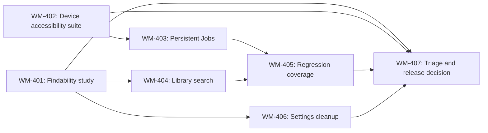

# Sprint 4 Task Board — Evidence, Recovery, and Release Confidence

**Board baseline:** `main` at `69ab748`
**Development branch:** `sprint4-release-confidence`
**Board source of truth:** This version-controlled board. Repository Issues are disabled and an owner-level GitHub Projects board is not available to the current integration, so task state is maintained here and reviewed through pull requests.

## Board rules

| Column | Meaning | Exit condition |
|---|---|---|
| **Ready** | Scope and acceptance criteria are understood; work may begin when dependencies are met. | A named owner moves it to In progress. |
| **In progress** | Active discovery, implementation, or validation work is underway. | Acceptance evidence is attached and review is requested. |
| **Blocked** | Work cannot proceed without a prerequisite, participant, device, or decision. | The blocker is removed and the story returns to Ready. |
| **Review** | Implementation or evidence is ready for product/technical review. | Review accepts the evidence or returns a remediation action. |
| **Done** | All stated acceptance criteria and required evidence are complete. | Any discovered regression creates a linked follow-up story. |

## Initial board

| ID | Story | Priority | Initial state | Dependencies | Primary deliverable | Definition of done |
|---|---|---|---|---|---|---|
| **WM-401** | Run and record the real-user findability study | P0 | **Ready** | Stable `main`, participant recruitment, prepared library, moderator guide | Participant task log, aggregate completion results, decision log | Five to seven users complete all core tasks; every task reaches 80% unassisted completion or has a remediated/retested disposition. |
| **WM-402** | Execute the physical-device accessibility and long-job suite | P0 | **Ready** | Supported devices, media fixtures, Android system-consent setup | Device matrix and defect/retest log | Long-job, multi-job, output recovery, 320dp/360dp, large text, TalkBack, RTL, and theme checks are recorded with no unresolved P0 defect. |
| **WM-403** | Provide a persistent Jobs destination and recent-history recovery | P1 | **Ready** | Existing media-job manager and jobs sheet; WM-402 device validation | Persistent Jobs destination, bounded local history, notification routing tests | Users can find active and terminal jobs after app restart and take safe context-specific actions. |
| **WM-404** | Add library search, no-results clarity, and recovery | P1 | **Ready** | Library UI state and ViewModels; WM-401 research signals | Accessible search, no-results state, clear/recovery actions, tests | Queries filter discoverably, no results are distinct from empty/error/indexing, and state restores predictably. |
| **WM-405** | Add behavioral and accessibility regression coverage | P1 | **Ready** | WM-403/WM-404 stable contracts; GitHub Actions | Named unit/UI regression suite and CI artifacts | Settings, playlist/delete semantics, library states, job outcomes, and critical semantics are verified on `main`. |
| **WM-406** | Complete settings language and contextual guidance cleanup | P2 | **Ready** | WM-401 findings, settings inventory, WM-405 coverage | Approved user-facing settings inventory and contextual entries | All remaining production settings use plain language, communicate an observable effect, and remain accessible. |
| **WM-407** | Triage findings, retest fixes, and issue the release recommendation | P0 | **Blocked** | WM-401 through WM-405; WM-406 where release-relevant | Consolidated decision log and Go/Go with non-blockers/Hold recommendation | All blocking findings are remediated and retested, open risks are explicit, and final `main` CI passes. |

## Dependency flow

## First planning cycle

| Order | Board action | Owner role | Evidence expected before moving on |
|---:|---|---|---|
| 1 | Move **WM-401** and **WM-402** to In progress after test preparation. | Product research lead and accessibility/device lead | Recruitment/device plan, fixture library, moderator script, and shared decision-log template. |
| 2 | Keep **WM-403** and **WM-404** Ready; begin only when implementation capacity does not compromise evidence gathering. | Android lead | Brief technical design and testability check. |
| 3 | Schedule **WM-405** after state contracts for Jobs and Search stabilize. | QA/Android lead | Named regression matrix mapped to prior P0/P1 findings. |
| 4 | Use study findings to scope **WM-406**, then move it to In progress only for validated trust/discoverability issues. | Product and design lead | Settings inventory with user-facing copy and proof-of-effect mapping. |
| 5 | Keep **WM-407** Blocked until the evidence and remediation branches are ready for retest. | Release owner | Consolidated findings and final main-branch CI link. |

## Operational notes

The board records delivery state; detailed acceptance criteria, scope boundaries, and Sprint exit conditions remain in [`sprint-4-backlog.md`](sprint-4-backlog.md). A task may not move directly from **Ready** to **Done** without recorded acceptance evidence. A P0 discovery, accessibility, data-loss, or destructive-action defect overrides lower-priority scope until it is triaged and retested.
